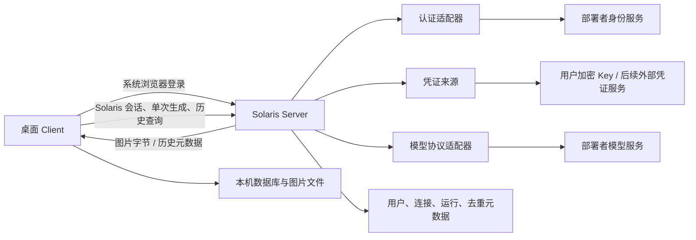

# Solaris Client / Server 重构大纲

日期：2026-09-29
状态：范围已按 [DECISIONS.md](DECISIONS.md) D1–D8、D15 同步；具体接口见 [CONTRACTS.md](CONTRACTS.md) v3 实施候选，尚未完成代码冻结。

## 1. 开源设计基线与首期范围

将本机 React + Fastify BFF 重构为可自托管 Server + Tauri v2/React 桌面 Client，macOS 首期，Windows 只保留平台接口边界。

- 部署者使用自己的身份服务与模型服务，不依赖维护者的内部基础设施。
- 维护者后续接入内部 SSO、配套凭证接口与 NewAPI；差异限制在服务端适配器和配置，不改变通用 Client。
- 首期公开认证采用 OIDC，系统浏览器 + PKCE + 回环回调；用户录入自己的模型 Key，Server 按用户和连接加密保存。
- 首期模型协议沿用现有 Gemini generateContent；其他服务只有协议一致时复用适配器，不同协议需显式实现。
- 首期只做同步单次图片生成及参考图编辑，删除视频、Batch、取消、上游轮询及 Server 素材库，不保留占位或兼容路径。
- 图片长期保存仅在 Client；Server 保存运行历史元数据和最小去重凭据，不持久化图片。

Batch 删除是维护者的范围决策。所测 NewAPI 实例的探测失败不能推广成全部 NewAPI 或其他模型服务均不支持 Batch。

## 2. 架构与扩展边界

认证负责稳定用户身份，凭证来源负责用户/连接的调用 Key，模型适配器负责能力、参数和同步调用。沿用 ProviderPlugin；不建设动态插件市场或任意协议映射。认证源和凭证来源独立配置，失败不回退其他 Key 或服务。

Client 只理解 Solaris 登录和业务 API，不硬编码 OIDC/内部 SSO 专有字段或 NewAPI 地址。模型能力由已实现的精确适配表与 operationConfigs 表达，不仅凭名称或协议标签推断可运行性。

## 3. 数据归属

| 数据 | Client | Server |
| --- | --- | --- |
| Solaris 会话 | 系统安全存储 | token 哈希、有效期、撤销状态 |
| 外部身份 | 不作为业务归属 | 身份源与稳定主体映射；不留上游登录 token |
| 模型 Key | 用户录入仅用于提交，不保存调用 Key | 按用户+连接加密；只返回 hasKey |
| 草稿、参考图 | 按 Server/用户隔离的本地数据库与文件 | 临时有界转发，不持久化参考图 |
| 提示词、参数、状态 | 本地副本 | 按用户运行历史 |
| 提交标识与摘要 | 本次运行稳定标识 | 最小幂等凭据；删除历史不解除去重 |
| 生成图片 | 文件保存 | 同步响应与短期有界内存重放缓存，非持久化 |
| 文件路径/保存状态 | 当前设备 | 不作为生成成功状态 |

旧本机数据不迁移。检测旧 schema 提示使用新的空数据目录，禁止启动时自动删除旧库/素材；清理另行明确执行。

## 4. 桌面职责

复用现有 React UI，Tauri 层只承担浏览器登录、回环监听、安全存储、本地 SQLite、文件选择/保存/预览。本地数据按规范化 Server origin + Solaris 用户 ID 隔离。

文件通过临时写入后原子提交，完成落盘才标已保存。磁盘满、无权限或文件遗失不得改变远程生成状态。Windows 首期不宣称实测通过；跨设备草稿、参考图和素材同步不在当前范围。

## 5. 登录与调用链路

1. Client 配置 Server，取得部署与统一桌面登录入口。
2. 系统浏览器经 Server 认证适配器登录；上游认证事务与桌面 PKCE 分开。
3. Server 验证身份，建立 Solaris 用户，用一次性码 + 桌面 verifier 换取 Solaris bearer 会话。
4. Client 管理自己的模型连接并提交 Key；Server 只写加密存储。
5. 生成时先校验会话、连接所有权、模型能力和参数，再经凭证来源解析 Key，调用模型服务。

内部 SSO 与配套 Key 服务分别接入同一边界；公开部署不需要内部接口。会话过期重新登录，没有上游后台任务授权需求。

## 6. 单次生成、幂等与结果交付

Client 为一次明确运行生成 submissionId，保存输入并上传参考图。Server 重算内容摘要，在事务中认领；并发重复请求只调用一次上游。明确失败与受理结果不明分开，未知结果不自动重提。

统一响应分别表达生成状态与本次结果可取性：pending、delivered、unavailable。历史元数据不含图片字节。删除历史保留最小去重凭据，不因原连接变更再执行旧提交。

模型完整调用时限覆盖响应头、响应体、解析与解码，原始响应和图片字节均有预算。进程启动收敛上次遗留 running，本进程活跃调用不得被陈旧扫描误判。没有上游轮询或重新生成恢复。

## 7. 本地保存与恢复限制

Server 短期内存缓存可在同一提交重放时交回图片，不持久化，TTL/LRU/重启均可能使缓存失效，不能保证恢复下载。

Client 收到字节后落盘。保存失败优先使用已收到字节重试；字节已丢失时只可尽力重放原提交。缓存失效明确显示图片不可取，不自动生成。用户显式重跑使用新 submissionId，并提示可能再次计费。

outputCount 现有逻辑只是最多保留返回图片的截断，无法保证生成张数。控件保留/改名/移除仍待确认，不自动用多次调用凑数。

## 8. 多设备行为

Server 提供按用户运行历史，Client 文件与草稿各设备独立保存。同步生成无可再次查询的上游任务，Server 又不持久化图片，因此不能承诺另一设备取回历史图片。

“跨设备仅看元数据”是否满足预期仍待确认。UI 只能按本设备文件展示已保存或缺失，不能从远程 success 推断可下载。

## 9. 代码调整与安全

| 模块 | 调整 |
| --- | --- |
| src/shared/contracts.ts | 统一 DTO、生成响应、错误/能力类型与摘要工具 |
| src/server/auth/、credentials/（新增） | 认证、会话与独立凭证来源 |
| repository.ts、db/ | 用户归属、运行历史与原子去重，删除视频/Batch 表 |
| providers/ | Gemini 单次适配、完整超时、响应预算、安全诊断 |
| services.ts | 同步生成、状态、内存重放缓存；删除 Batch/视频编排 |
| runner.ts | 删除旧上游轮询器；进程遗留状态收敛独立实现 |
| assets.ts | 删除 Server 素材持久化路径；本地文件能力迁入 Client |
| vault.ts | 保留 AES-256-GCM 格式，AAD 用户+连接，修复图片/凭证日志泄漏 |
| http/、main.ts、env.ts | 统一远程 API、配置与安全边界接线 |
| src/client/、src-tauri/ | 远程工作流与桌面本地数据 |

远程 Host/origin/代理信任、HTTPS、会话与资源权限完成并通过 focused 安全测试后，才替换旧 loopback/same-origin 限制。保留上传 MIME/数量/体积和 strict 参数校验。日志采用安全字段白名单，不写完整 provider 请求、base64 或秘密。

## 10. 实施与验收

先冻结真实接口与共同可编译基线，再并行 B02 存储、B03 认证/凭证、B04 适配器、B06 桌面；后续 B05 编排与 B07 UI 并行，B08 集成公开链路，B09 后续内部接入，B10 macOS 自托管交付。每波按 D8 汇报证据与风险。

关键验收：非内部部署独立运行、用户资源隔离、并发/重放不重复生成、删除历史后仍去重、未知结果不重提、完整超时、缓存失效与保存失败正确表达、无 Server 图片持久化/秘密泄漏，以及 macOS 实机登录与保存。

## 11. 尚待确认

- outputCount 仅截断语义与控件处理。
- 跨设备仅看元数据是否可接受。
- D9–D13 建议项的冻结结论。
- 交付/原始响应/内存缓存预算（B04/B08 实测）。
- 内部 SSO 身份和凭证协议、目标 NewAPI 实例版本及真实单次能力。

## 12. 剩余风险

- App/Server 重启、网络中断或缓存淘汰后，尚未保存的图片可能永久不可取。
- 同步调用结果不明可能已经计费，显式重跑可能重复收费。
- 各模型/网关协议与元数据质量不同，单实例实测不能推广。
- 身份源切换不会自动合并旧账号；旧数据不迁移。
- 大图、并发和内联 base64 带来内存与带宽压力；Windows 未实测。
